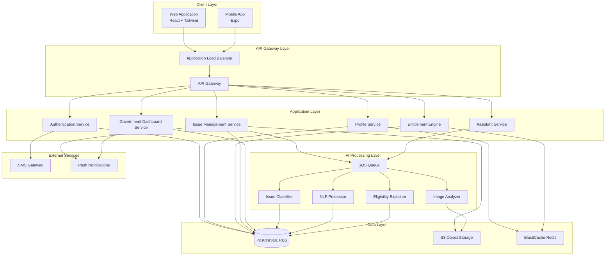
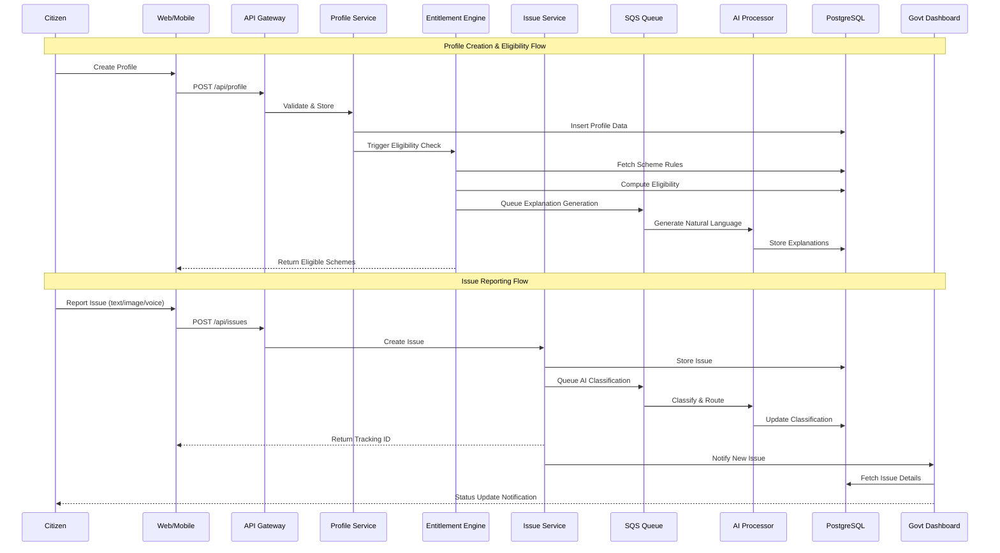
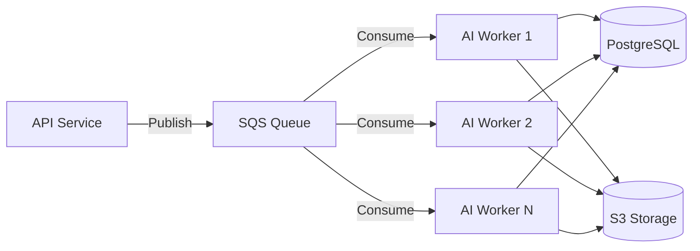
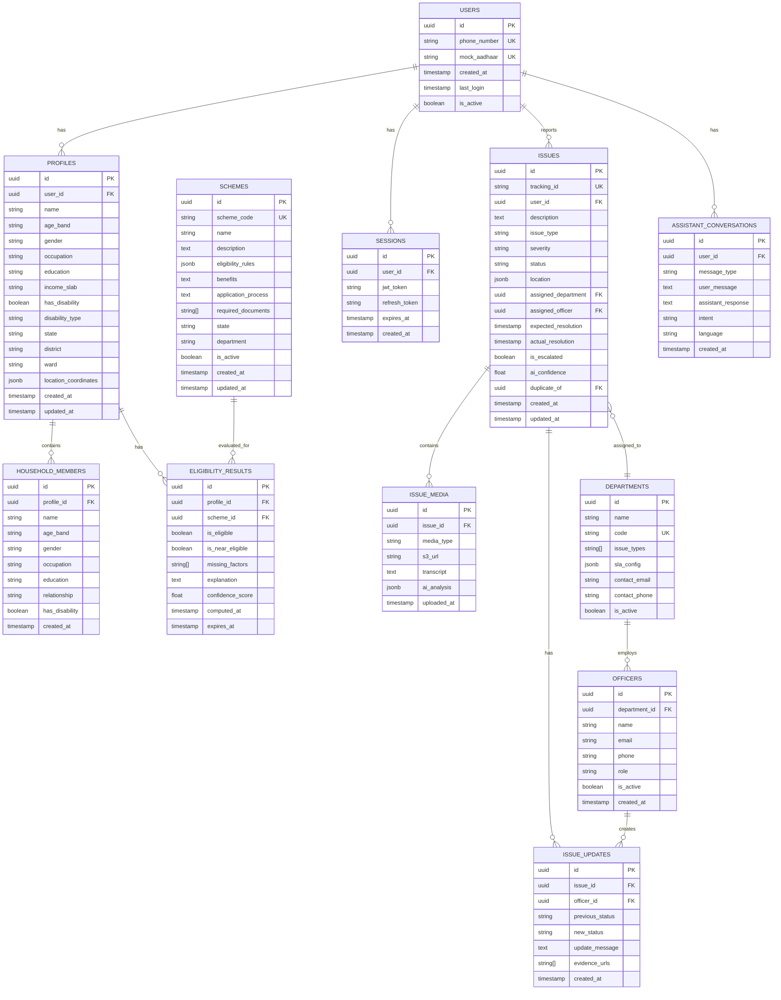
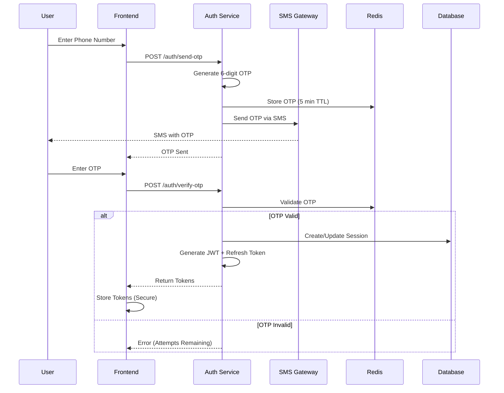
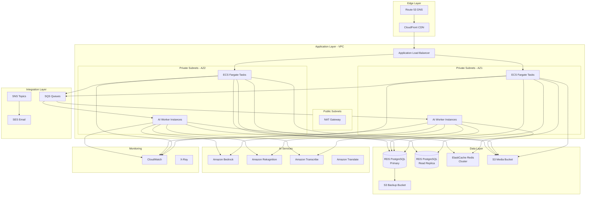

# Design Document: Unified Civic Intelligence Platform

## Overview

The Unified Civic Intelligence Platform is architected as a cloud-native, microservices-oriented system designed for production-grade scalability and security. The platform serves as a persistent civic middleware layer that maintains citizen context and transforms civic signals into executable government tasks.

### Key Architectural Decisions

1. **AWS-First Architecture**: Leveraging AWS managed services for reliability and scalability
2. **Stateless Backend Services**: Enabling horizontal scaling and fault tolerance
3. **Rule-Based Eligibility with AI Assistance**: Deterministic scheme matching with AI for explanation and user experience
4. **Asynchronous AI Processing**: Heavy AI tasks processed via queue to maintain API responsiveness
5. **Hybrid Mobile Strategy**: Expo-based shell wrapping web APIs for rapid development and consistency

### Design Principles

- **Separation of Concerns**: Clear boundaries between citizen-facing, government-facing, and AI processing layers
- **Data Sovereignty**: Single source of truth in PostgreSQL with proper normalization
- **Security by Design**: Encryption, RBAC, and audit logging at every layer
- **Graceful Degradation**: System remains functional even when AI services are unavailable
- **API-First Development**: All features exposed through RESTful APIs

## System Architecture

### High-Level Architecture




### Component Interaction Flow




## Components and Interfaces

### 1. Authentication Service

**Purpose**: Manages user authentication, session management, and identity verification

**Responsibilities**:
- OTP generation and validation
- Session token management (JWT)
- Mock Aadhaar identifier assignment
- Rate limiting for authentication attempts
- Account lockout management

**API Endpoints**:
```typescript
POST   /api/auth/send-otp          // Send OTP to phone
POST   /api/auth/verify-otp        // Verify OTP and create session
POST   /api/auth/logout            // Invalidate session
GET    /api/auth/session           // Validate current session
POST   /api/auth/refresh-token     // Refresh JWT token
```

**Dependencies**:
- PostgreSQL (user credentials, session storage)
- SMS Gateway (OTP delivery)
- Redis (OTP temporary storage, rate limiting)

**Security Considerations**:
- OTP stored hashed in Redis with 5-minute TTL
- JWT tokens with 24-hour expiration
- Refresh tokens with 30-day expiration
- Rate limiting: 3 OTP requests per 15 minutes per phone number

---

### 2. Profile Service

**Purpose**: Manages citizen and household profile data

**Responsibilities**:
- CRUD operations for citizen profiles
- Household member management
- Profile validation and data integrity
- Change propagation to dependent services
- Profile data encryption

**API Endpoints**:
```typescript
POST   /api/profile                // Create new profile
GET    /api/profile/:userId        // Get profile details
PUT    /api/profile/:userId        // Update profile
DELETE /api/profile/:userId        // Delete profile (anonymize)
POST   /api/profile/:userId/members    // Add household member
PUT    /api/profile/:userId/members/:memberId  // Update member
DELETE /api/profile/:userId/members/:memberId  // Remove member
GET    /api/profile/:userId/complete-status    // Check profile completeness
```

**Dependencies**:
- PostgreSQL (profile storage)
- Redis (profile caching)
- Entitlement Engine (eligibility recalculation trigger)

**Data Validation Rules**:
- Age band: enum (0-5, 6-17, 18-35, 36-60, 60+)
- Gender: enum (male, female, other, prefer-not-to-say)
- Occupation: enum (employed, self-employed, unemployed, student, retired)
- Education: enum (no-formal, primary, secondary, graduate, post-graduate)
- Income slab: enum (<50k, 50k-1L, 1L-2.5L, 2.5L-5L, 5L+)
- Disability: boolean + type if true

---

### 3. Entitlement Intelligence Engine

**Purpose**: Continuously evaluates citizen eligibility for government schemes

**Responsibilities**:
- Rule-based eligibility computation
- Scheme matching against profile attributes
- Near-eligibility detection with gap analysis
- Eligibility explanation generation (via AI)
- Caching of eligibility results

**API Endpoints**:
```typescript
GET    /api/entitlements/:userId/eligible       // Currently eligible schemes
GET    /api/entitlements/:userId/near-eligible  // Near-eligible schemes
GET    /api/entitlements/:userId/all            // All schemes with status
GET    /api/entitlements/schemes/:schemeId      // Scheme details
POST   /api/entitlements/recalculate/:userId    // Force recalculation
```

**Eligibility Computation Logic**:
```typescript
interface SchemeRule {
  schemeId: string;
  name: string;
  conditions: {
    ageRange?: [number, number];
    gender?: string[];
    occupation?: string[];
    incomeMax?: number;
    education?: string[];
    disability?: boolean;
    location?: string[];  // state/district level
    householdSize?: [number, number];
  };
  benefits: string;
  applicationProcess: string;
  requiredDocuments: string[];
}

function evaluateEligibility(profile: Profile, scheme: SchemeRule): EligibilityResult {
  // Rule-based matching
  const matches = checkAllConditions(profile, scheme.conditions);
  const missingFactors = identifyGaps(profile, scheme.conditions);
  
  return {
    eligible: matches,
    nearEligible: missingFactors.length <= 2,
    missingFactors,
    confidence: calculateConfidence(matches, missingFactors)
  };
}
```

**Dependencies**:
- PostgreSQL (scheme rules, eligibility results)
- Redis (eligibility caching - 24 hour TTL)
- AI Explainer (natural language generation)
- SQS Queue (async explanation generation)

**Performance Optimization**:
- Eligibility results cached per user for 24 hours
- Incremental recalculation on profile updates
- Indexed queries on profile attributes
- Batch processing for scheme rule updates

---

### 4. Issue Management Service

**Purpose**: Handles civic issue reporting, tracking, and lifecycle management

**Responsibilities**:
- Issue creation with multi-modal input
- Media upload handling (images, voice)
- GPS location capture and validation
- Issue tracking and status updates
- Duplicate detection
- SLA monitoring and escalation

**API Endpoints**:
```typescript
POST   /api/issues                     // Create new issue
GET    /api/issues/:issueId            // Get issue details
PUT    /api/issues/:issueId/status     // Update issue status
GET    /api/issues/user/:userId        // Get user's issues
GET    /api/issues/search              // Search/filter issues
POST   /api/issues/:issueId/feedback   // Submit feedback on resolution
POST   /api/issues/:issueId/reopen     // Reopen resolved issue
GET    /api/issues/:issueId/history    // Get status history
```

**Issue Data Model**:
```typescript
interface Issue {
  issueId: string;              // UUID
  userId: string;
  trackingId: string;           // Human-readable (e.g., MUM-2026-001234)
  description: string;
  issueType: IssueType;         // AI-classified
  severity: Severity;           // AI-estimated
  status: IssueStatus;
  location: {
    latitude: number;
    longitude: number;
    address: string;
    ward: string;
    district: string;
    state: string;
  };
  media: {
    images: string[];           // S3 URLs
    voiceNote: string;          // S3 URL
    voiceTranscript: string;    // AI-generated
  };
  routing: {
    department: string;
    assignedOfficer: string;
    assignedAt: Date;
  };
  sla: {
    expectedResolution: Date;
    actualResolution: Date;
    escalated: boolean;
  };
  aiMetadata: {
    classificationConfidence: number;
    duplicateOf: string;        // Issue ID if duplicate
    suggestedPriority: Severity;
  };
  createdAt: Date;
  updatedAt: Date;
}

enum IssueType {
  INFRASTRUCTURE = 'infrastructure',
  SANITATION = 'sanitation',
  UTILITIES = 'utilities',
  SAFETY = 'safety',
  OTHER = 'other'
}

enum Severity {
  LOW = 'low',
  MEDIUM = 'medium',
  HIGH = 'high',
  CRITICAL = 'critical'
}

enum IssueStatus {
  SUBMITTED = 'submitted',
  CLASSIFIED = 'classified',
  ASSIGNED = 'assigned',
  IN_PROGRESS = 'in_progress',
  PENDING_INFO = 'pending_info',
  RESOLVED = 'resolved',
  CLOSED = 'closed',
  ESCALATED = 'escalated'
}
```

**Dependencies**:
- PostgreSQL (issue storage, status history)
- S3 (media storage)
- SQS Queue (AI classification, duplicate detection)
- Push Notification Service (status updates)
- Redis (rate limiting, duplicate detection cache)

**Media Handling**:
- Images: Max 10MB, formats JPG/PNG/HEIC, stored in S3 with CDN
- Voice: Max 2 minutes, format MP3/M4A, transcribed via AI
- Malware scanning before storage
- Automatic compression and optimization

---

### 5. Civic Assistant Service

**Purpose**: Provides multilingual conversational AI assistance

**Responsibilities**:
- Natural language query processing
- Scheme information retrieval
- Workflow guidance
- Language translation
- Context-aware responses based on user profile

**API Endpoints**:
```typescript
POST   /api/assistant/chat             // Send message to assistant
GET    /api/assistant/history/:userId  // Get conversation history
POST   /api/assistant/language         // Set preferred language
GET    /api/assistant/suggestions      // Get contextual suggestions
```

**Assistant Capabilities**:
```typescript
interface AssistantCapability {
  // Query Understanding
  intentClassification: (query: string) => Intent;
  entityExtraction: (query: string) => Entity[];
  
  // Response Generation
  schemeExplanation: (schemeId: string, userProfile: Profile) => string;
  eligibilityExplanation: (userId: string, schemeId: string) => string;
  workflowGuidance: (workflow: string, currentStep: number) => string;
  
  // Multilingual Support
  translation: (text: string, targetLang: string) => string;
  languageDetection: (text: string) => string;
}

enum Intent {
  SCHEME_INQUIRY = 'scheme_inquiry',
  ELIGIBILITY_CHECK = 'eligibility_check',
  ISSUE_HELP = 'issue_help',
  PROFILE_UPDATE = 'profile_update',
  STATUS_CHECK = 'status_check',
  GENERAL_QUESTION = 'general_question'
}
```

**Dependencies**:
- AI NLP Service (intent classification, entity extraction)
- Profile Service (user context)
- Entitlement Engine (scheme data)
- Translation API (multilingual support)
- PostgreSQL (conversation history)

**Supported Languages**:
- Primary: Hindi, English
- Regional: Marathi, Tamil, Telugu, Bengali, Gujarati, Kannada

---

### 6. Government Dashboard Service

**Purpose**: Provides government administrators and officers with issue management interface

**Responsibilities**:
- Issue queue management
- Department routing and assignment
- SLA monitoring and alerts
- Analytics and reporting
- Performance metrics

**API Endpoints**:
```typescript
GET    /api/govt/dashboard/summary         // Dashboard overview
GET    /api/govt/issues/queue              // Pending issues queue
PUT    /api/govt/issues/:issueId/assign    // Assign to officer
GET    /api/govt/issues/department/:dept   // Department-specific issues
GET    /api/govt/analytics/trends          // Trend analysis
GET    /api/govt/analytics/performance     // Department performance
POST   /api/govt/reports/export            // Export data
GET    /api/govt/alerts/sla                // SLA breach alerts
```

**Dashboard Metrics**:
```typescript
interface DashboardSummary {
  totalIssues: number;
  pendingIssues: number;
  overdueIssues: number;
  resolvedToday: number;
  avgResolutionTime: number;  // hours
  departmentBreakdown: {
    department: string;
    pending: number;
    resolved: number;
    avgTime: number;
  }[];
  severityDistribution: {
    low: number;
    medium: number;
    high: number;
    critical: number;
  };
  geographicHotspots: {
    ward: string;
    issueCount: number;
    topIssueType: string;
  }[];
}
```

**Dependencies**:
- PostgreSQL (issue data, analytics)
- Redis (real-time metrics caching)
- Issue Management Service (issue operations)
- Notification Service (alerts)

**SLA Configuration**:
```typescript
const SLA_TIMELINES = {
  critical: 4,    // hours
  high: 24,       // hours
  medium: 72,     // hours
  low: 168        // hours (7 days)
};

const ESCALATION_RULES = {
  unassigned_24h: 'escalate_to_senior',
  sla_80_percent: 'send_warning',
  sla_breach: 'escalate_to_admin'
};
```


## AI Processing Layer

### Architecture Pattern

AI processing is decoupled from synchronous API flows using an event-driven architecture:



### AI Components

#### 1. Issue Classifier

**Purpose**: Automatically categorize civic issues into predefined types

**Input**:
- Text description
- Voice transcript
- Image features (optional)
- Location context

**Output**:
```typescript
interface ClassificationResult {
  issueType: IssueType;
  confidence: number;
  suggestedDepartment: string;
  suggestedSeverity: Severity;
  reasoning: string;
}
```

**Model Approach**:
- Text classification using fine-tuned transformer model (BERT/DistilBERT)
- Multi-modal fusion when images available
- Location-aware classification (e.g., coastal areas → drainage issues)
- Confidence threshold: 0.7 for auto-classification

**Training Data**:
- Historical civic complaint datasets
- Synthetic data generation for edge cases
- Continuous learning from human corrections

---

#### 2. Duplicate Detector

**Purpose**: Identify duplicate or similar issue reports

**Approach**:
```typescript
interface DuplicateDetection {
  // Semantic similarity using embeddings
  textSimilarity: (issue1: string, issue2: string) => number;
  
  // Spatial proximity
  locationProximity: (loc1: Location, loc2: Location) => number;
  
  // Temporal proximity
  timeProximity: (time1: Date, time2: Date) => number;
  
  // Combined score
  duplicateScore: (issue1: Issue, issue2: Issue) => number;
}

// Duplicate if:
// - Text similarity > 0.85 AND
// - Location within 100m AND
// - Reported within 7 days
```

**Implementation**:
- Sentence embeddings (Sentence-BERT)
- Vector similarity search (FAISS or PostgreSQL pgvector)
- Spatial indexing (PostGIS)
- Real-time duplicate checking on submission

---

#### 3. Image Analyzer

**Purpose**: Extract relevant information from uploaded images

**Capabilities**:
- Object detection (potholes, garbage, broken infrastructure)
- Scene classification (road, park, building, water body)
- Text extraction (OCR for signs, notices)
- Quality assessment (blur detection, lighting)

**Model Stack**:
- Object detection: YOLOv8 or EfficientDet
- Scene classification: ResNet or EfficientNet
- OCR: Tesseract or cloud OCR API
- Image quality: Custom CNN

**Output**:
```typescript
interface ImageAnalysis {
  detectedObjects: {
    label: string;
    confidence: number;
    boundingBox: [number, number, number, number];
  }[];
  sceneType: string;
  extractedText: string;
  qualityScore: number;
  relevanceScore: number;  // How relevant to civic issues
}
```

---

#### 4. Voice Processor

**Purpose**: Transcribe and analyze voice-based issue reports

**Pipeline**:
1. Audio preprocessing (noise reduction, normalization)
2. Speech-to-text transcription
3. Language detection
4. Sentiment analysis
5. Key phrase extraction

**Technology Stack**:
- Speech-to-text: AWS Transcribe or Whisper API
- Language detection: langdetect library
- Sentiment: Fine-tuned BERT for civic context
- Key phrases: spaCy NER + custom rules

**Output**:
```typescript
interface VoiceAnalysis {
  transcript: string;
  language: string;
  confidence: number;
  sentiment: 'positive' | 'negative' | 'neutral' | 'urgent';
  keyPhrases: string[];
  duration: number;
}
```

---

#### 5. Eligibility Explainer

**Purpose**: Generate natural language explanations for eligibility decisions

**Input**:
- User profile
- Scheme rules
- Eligibility result (eligible/not eligible/near-eligible)

**Output**:
```typescript
interface EligibilityExplanation {
  summary: string;  // "You are eligible because..."
  matchedCriteria: string[];
  missingCriteria: string[];
  actionableSteps: string[];  // What to do to become eligible
  language: string;
}
```

**Generation Approach**:
- Template-based generation for consistency
- LLM-based generation (GPT-3.5/4) for complex cases
- Multilingual templates
- Fact-checking against actual rules

**Example Templates**:
```typescript
const templates = {
  eligible: {
    en: "You are eligible for {scheme_name} because you meet the following criteria: {criteria_list}. To apply, you need: {documents}.",
    hi: "आप {scheme_name} के लिए पात्र हैं क्योंकि आप निम्नलिखित मानदंडों को पूरा करते हैं: {criteria_list}। आवेदन करने के लिए, आपको चाहिए: {documents}।"
  },
  nearEligible: {
    en: "You are almost eligible for {scheme_name}. You currently meet: {matched}. To become eligible, you need: {missing}.",
    hi: "आप {scheme_name} के लिए लगभग पात्र हैं। आप वर्तमान में पूरा करते हैं: {matched}। पात्र बनने के लिए, आपको चाहिए: {missing}।"
  }
};
```

---

### AI Service Integration

**AWS Services**:
- **Amazon Bedrock**: LLM access for explanation generation
- **Amazon Rekognition**: Image analysis and object detection
- **Amazon Transcribe**: Speech-to-text for voice notes
- **Amazon Translate**: Multilingual translation
- **Amazon Comprehend**: Sentiment analysis and entity extraction

**Self-Hosted Models**:
- Issue classifier (fine-tuned BERT)
- Duplicate detector (Sentence-BERT + FAISS)
- Custom image models for civic-specific objects

**Fallback Strategy**:
- If AI service unavailable, queue for later processing
- Manual classification option for administrators
- Cached results for common queries
- Graceful degradation to rule-based systems


## Data Models

### Database Schema



### Key Data Structures

#### Profile Data Structure
```typescript
interface Profile {
  id: string;
  userId: string;
  personalInfo: {
    name: string;
    ageBand: '0-5' | '6-17' | '18-35' | '36-60' | '60+';
    gender: 'male' | 'female' | 'other' | 'prefer-not-to-say';
    occupation: 'employed' | 'self-employed' | 'unemployed' | 'student' | 'retired';
    education: 'no-formal' | 'primary' | 'secondary' | 'graduate' | 'post-graduate';
    incomeSlab: '<50k' | '50k-1L' | '1L-2.5L' | '2.5L-5L' | '5L+';
    disability: {
      hasDisability: boolean;
      type?: string;
    };
  };
  location: {
    state: string;
    district: string;
    ward: string;
    coordinates?: {
      latitude: number;
      longitude: number;
    };
  };
  householdMembers: HouseholdMember[];
  createdAt: Date;
  updatedAt: Date;
}

interface HouseholdMember {
  id: string;
  name: string;
  ageBand: string;
  gender: string;
  occupation: string;
  education: string;
  relationship: 'spouse' | 'child' | 'parent' | 'sibling' | 'other';
  disability: {
    hasDisability: boolean;
    type?: string;
  };
}
```

#### Scheme Rule Structure
```typescript
interface SchemeRule {
  id: string;
  schemeCode: string;
  name: string;
  description: string;
  eligibilityRules: {
    age?: {
      min?: number;
      max?: number;
      bands?: string[];
    };
    gender?: string[];
    occupation?: string[];
    education?: string[];
    income?: {
      max?: string;
      slabs?: string[];
    };
    disability?: {
      required?: boolean;
      types?: string[];
    };
    location?: {
      states?: string[];
      districts?: string[];
    };
    household?: {
      minSize?: number;
      maxSize?: number;
      hasChildren?: boolean;
      hasSeniors?: boolean;
    };
    customRules?: {
      field: string;
      operator: 'equals' | 'contains' | 'greaterThan' | 'lessThan';
      value: any;
    }[];
  };
  benefits: string;
  applicationProcess: string;
  requiredDocuments: string[];
  state: string;
  department: string;
  isActive: boolean;
}
```

### Database Indexes

**Critical Indexes for Performance**:
```sql
-- User lookups
CREATE INDEX idx_users_phone ON users(phone_number);
CREATE INDEX idx_users_aadhaar ON users(mock_aadhaar);

-- Profile queries
CREATE INDEX idx_profiles_user_id ON profiles(user_id);
CREATE INDEX idx_profiles_location ON profiles(state, district, ward);

-- Eligibility lookups
CREATE INDEX idx_eligibility_profile ON eligibility_results(profile_id);
CREATE INDEX idx_eligibility_scheme ON eligibility_results(scheme_id);
CREATE INDEX idx_eligibility_expires ON eligibility_results(expires_at);

-- Issue queries
CREATE INDEX idx_issues_tracking ON issues(tracking_id);
CREATE INDEX idx_issues_user ON issues(user_id);
CREATE INDEX idx_issues_status ON issues(status);
CREATE INDEX idx_issues_department ON issues(assigned_department);
CREATE INDEX idx_issues_officer ON issues(assigned_officer);
CREATE INDEX idx_issues_created ON issues(created_at DESC);
CREATE INDEX idx_issues_location ON issues USING GIN(location);

-- Spatial queries (requires PostGIS)
CREATE INDEX idx_issues_geo ON issues USING GIST(
  ST_SetSRID(ST_MakePoint(
    (location->>'longitude')::float,
    (location->>'latitude')::float
  ), 4326)
);

-- Full-text search
CREATE INDEX idx_issues_description_fts ON issues USING GIN(to_tsvector('english', description));
```

### Data Retention and Archival

**Retention Policies**:
```typescript
const RETENTION_POLICIES = {
  sessions: 30,              // days
  otpCodes: 0.003,          // days (5 minutes)
  eligibilityCache: 1,      // days
  resolvedIssues: 365,      // days before archival
  assistantConversations: 90, // days
  auditLogs: 730            // days (2 years)
};
```

**Archival Strategy**:
- Resolved issues older than 1 year moved to cold storage (S3 Glacier)
- Maintain issue metadata in database for reporting
- Media files archived after 6 months
- Anonymize personal data after account deletion (30-day grace period)


## Security Architecture

### Authentication and Authorization

#### Authentication Flow


#### JWT Token Structure
```typescript
interface JWTPayload {
  sub: string;           // User ID
  phone: string;         // Phone number
  role: 'citizen' | 'officer' | 'admin';
  iat: number;           // Issued at
  exp: number;           // Expiration (24 hours)
  jti: string;           // JWT ID for revocation
}

interface RefreshTokenPayload {
  sub: string;
  jti: string;
  exp: number;           // Expiration (30 days)
}
```

#### Role-Based Access Control (RBAC)

```typescript
enum Permission {
  // Citizen permissions
  VIEW_OWN_PROFILE = 'profile:view:own',
  EDIT_OWN_PROFILE = 'profile:edit:own',
  VIEW_OWN_ELIGIBILITY = 'eligibility:view:own',
  CREATE_ISSUE = 'issue:create',
  VIEW_OWN_ISSUES = 'issue:view:own',
  
  // Officer permissions
  VIEW_ASSIGNED_ISSUES = 'issue:view:assigned',
  UPDATE_ASSIGNED_ISSUES = 'issue:update:assigned',
  VIEW_DEPARTMENT_ANALYTICS = 'analytics:view:department',
  
  // Admin permissions
  VIEW_ALL_ISSUES = 'issue:view:all',
  ASSIGN_ISSUES = 'issue:assign',
  VIEW_ALL_ANALYTICS = 'analytics:view:all',
  MANAGE_DEPARTMENTS = 'department:manage',
  MANAGE_OFFICERS = 'officer:manage',
  VIEW_AUDIT_LOGS = 'audit:view'
}

const ROLE_PERMISSIONS = {
  citizen: [
    Permission.VIEW_OWN_PROFILE,
    Permission.EDIT_OWN_PROFILE,
    Permission.VIEW_OWN_ELIGIBILITY,
    Permission.CREATE_ISSUE,
    Permission.VIEW_OWN_ISSUES
  ],
  officer: [
    Permission.VIEW_ASSIGNED_ISSUES,
    Permission.UPDATE_ASSIGNED_ISSUES,
    Permission.VIEW_DEPARTMENT_ANALYTICS
  ],
  admin: [
    Permission.VIEW_ALL_ISSUES,
    Permission.ASSIGN_ISSUES,
    Permission.VIEW_ALL_ANALYTICS,
    Permission.MANAGE_DEPARTMENTS,
    Permission.MANAGE_OFFICERS,
    Permission.VIEW_AUDIT_LOGS
  ]
};
```

### Data Encryption

**Encryption at Rest**:
```typescript
// Sensitive fields encrypted in database
const ENCRYPTED_FIELDS = [
  'users.phone_number',
  'users.mock_aadhaar',
  'profiles.name',
  'household_members.name',
  'officers.email',
  'officers.phone'
];

// Encryption approach
interface EncryptionConfig {
  algorithm: 'AES-256-GCM';
  keyManagement: 'AWS KMS';
  keyRotation: '90 days';
  fieldLevelEncryption: true;
}
```

**Encryption in Transit**:
- TLS 1.3 for all API communication
- Certificate pinning for mobile apps
- HSTS headers enforced
- No mixed content allowed

### Security Measures

#### Rate Limiting
```typescript
const RATE_LIMITS = {
  auth: {
    sendOTP: { requests: 3, window: '15m', per: 'phone' },
    verifyOTP: { requests: 5, window: '15m', per: 'phone' },
    login: { requests: 10, window: '1h', per: 'ip' }
  },
  api: {
    general: { requests: 100, window: '1m', per: 'user' },
    issueCreation: { requests: 10, window: '1h', per: 'user' },
    mediaUpload: { requests: 20, window: '1h', per: 'user' }
  },
  govt: {
    dashboard: { requests: 200, window: '1m', per: 'user' },
    export: { requests: 5, window: '1h', per: 'user' }
  }
};
```

#### Input Validation and Sanitization
```typescript
// All inputs validated using Zod schemas
import { z } from 'zod';

const ProfileSchema = z.object({
  name: z.string().min(2).max(100).regex(/^[a-zA-Z\s]+$/),
  ageBand: z.enum(['0-5', '6-17', '18-35', '36-60', '60+']),
  phone: z.string().regex(/^[6-9]\d{9}$/),
  // ... other fields
});

// SQL injection prevention
// - Use parameterized queries exclusively
// - ORM (Prisma/TypeORM) for query building
// - No raw SQL from user input

// XSS prevention
// - Content Security Policy headers
// - Output encoding for all user-generated content
// - React's built-in XSS protection
// - DOMPurify for rich text sanitization
```

#### Media Upload Security
```typescript
interface MediaSecurityConfig {
  // File validation
  allowedTypes: ['image/jpeg', 'image/png', 'image/heic', 'audio/mpeg', 'audio/mp4'];
  maxFileSize: 10 * 1024 * 1024; // 10MB
  
  // Malware scanning
  scanBeforeStorage: true;
  scanService: 'AWS GuardDuty' | 'ClamAV';
  
  // Storage security
  s3Config: {
    encryption: 'AES-256',
    publicAccess: false,
    signedUrls: true,
    urlExpiration: 3600 // 1 hour
  };
  
  // Image processing
  stripMetadata: true;  // Remove EXIF data
  reEncode: true;       // Re-encode to prevent exploits
  maxDimensions: { width: 4096, height: 4096 };
}
```

### Audit Logging

```typescript
interface AuditLog {
  id: string;
  timestamp: Date;
  userId: string;
  userRole: string;
  action: string;
  resource: string;
  resourceId: string;
  ipAddress: string;
  userAgent: string;
  requestId: string;
  changes?: {
    before: any;
    after: any;
  };
  result: 'success' | 'failure';
  errorMessage?: string;
}

// Actions requiring audit logging
const AUDITED_ACTIONS = [
  'auth.login',
  'auth.logout',
  'profile.view',
  'profile.update',
  'profile.delete',
  'issue.create',
  'issue.view',
  'issue.assign',
  'issue.update',
  'eligibility.view',
  'admin.access_dashboard',
  'admin.export_data',
  'officer.view_citizen_data'
];
```

### Compliance and Privacy

**Data Protection Principles**:
1. **Data Minimization**: Collect only necessary information
2. **Purpose Limitation**: Use data only for stated purposes
3. **Storage Limitation**: Retain data only as long as needed
4. **Accuracy**: Ensure data is accurate and up-to-date
5. **Integrity and Confidentiality**: Protect against unauthorized access
6. **Accountability**: Maintain audit trails

**User Rights**:
```typescript
interface UserPrivacyRights {
  rightToAccess: () => Promise<UserData>;           // Export all user data
  rightToRectification: (data: Partial<Profile>) => Promise<void>;  // Update data
  rightToErasure: () => Promise<void>;              // Delete account (anonymize)
  rightToRestriction: () => Promise<void>;          // Restrict processing
  rightToDataPortability: () => Promise<ExportFile>; // Export in machine-readable format
  rightToObject: () => Promise<void>;               // Object to processing
}
```

**Anonymization on Account Deletion**:
```sql
-- Anonymization procedure
UPDATE users SET
  phone_number = 'DELETED_' || id,
  mock_aadhaar = 'DELETED_' || id,
  is_active = false
WHERE id = $1;

UPDATE profiles SET
  name = 'Deleted User',
  -- Retain demographic data for analytics (anonymized)
WHERE user_id = $1;

-- Retain issues but anonymize
UPDATE issues SET
  user_id = '00000000-0000-0000-0000-000000000000'
WHERE user_id = $1;
```


## Infrastructure and Deployment

### AWS Architecture



### Infrastructure Components

#### Compute Layer
```typescript
interface ComputeConfig {
  // API Services
  apiService: {
    platform: 'AWS ECS Fargate';
    containerImage: 'node:20-alpine';
    cpu: '1 vCPU';
    memory: '2 GB';
    minInstances: 2;
    maxInstances: 20;
    autoScaling: {
      targetCPU: 70;
      targetMemory: 80;
      scaleUpCooldown: 60;  // seconds
      scaleDownCooldown: 300;
    };
  };
  
  // AI Workers
  aiWorkers: {
    platform: 'AWS ECS Fargate' | 'EC2 with GPU';
    cpu: '4 vCPU';
    memory: '8 GB';
    gpu?: 'NVIDIA T4';  // For image processing
    minInstances: 1;
    maxInstances: 10;
    autoScaling: {
      targetQueueDepth: 100;
      scaleUpCooldown: 120;
      scaleDownCooldown: 600;
    };
  };
}
```

#### Database Configuration
```typescript
interface DatabaseConfig {
  engine: 'PostgreSQL 15';
  instanceClass: 'db.r6g.xlarge';  // 4 vCPU, 32 GB RAM
  storage: {
    type: 'gp3';
    size: 500;  // GB
    iops: 12000;
    throughput: 500;  // MB/s
    autoScaling: {
      enabled: true;
      maxSize: 2000;  // GB
    };
  };
  multiAZ: true;
  readReplicas: 2;
  backups: {
    retentionPeriod: 30;  // days
    window: '03:00-04:00';  // UTC
    pitr: true;  // Point-in-time recovery
  };
  encryption: {
    atRest: true;
    kmsKeyId: 'aws/rds';
  };
  performanceInsights: true;
}
```

#### Caching Layer
```typescript
interface CacheConfig {
  engine: 'Redis 7.0';
  nodeType: 'cache.r6g.large';  // 2 vCPU, 13.07 GB RAM
  clusterMode: true;
  shards: 3;
  replicasPerShard: 2;
  autoFailover: true;
  
  cachingStrategy: {
    profiles: { ttl: 3600 },           // 1 hour
    eligibility: { ttl: 86400 },       // 24 hours
    schemes: { ttl: 43200 },           // 12 hours
    sessions: { ttl: 86400 },          // 24 hours
    rateLimits: { ttl: 900 }           // 15 minutes
  };
}
```

#### Storage Configuration
```typescript
interface StorageConfig {
  mediaBucket: {
    name: 'civic-platform-media';
    region: 'ap-south-1';
    encryption: 'AES-256';
    versioning: true;
    lifecycle: [
      {
        id: 'archive-old-media',
        transition: {
          days: 180,
          storageClass: 'GLACIER'
        }
      },
      {
        id: 'delete-temp-files',
        expiration: {
          days: 7,
          prefix: 'temp/'
        }
      }
    ];
    cors: {
      allowedOrigins: ['https://civic-platform.gov.in'],
      allowedMethods: ['GET', 'PUT', 'POST'],
      maxAge: 3600
    };
  };
  
  backupBucket: {
    name: 'civic-platform-backups';
    encryption: 'AES-256';
    versioning: true;
    lifecycle: [
      {
        id: 'transition-to-glacier',
        transition: {
          days: 90,
          storageClass: 'GLACIER_DEEP_ARCHIVE'
        }
      }
    ];
  };
}
```

### Deployment Strategy

#### CI/CD Pipeline


#### Deployment Configuration
```typescript
interface DeploymentConfig {
  strategy: 'blue-green';
  
  stages: {
    development: {
      autoDeployOnPush: true;
      environment: 'dev';
      instances: 1;
    };
    staging: {
      autoDeployOnPush: false;
      environment: 'staging';
      instances: 2;
      requiresApproval: false;
    };
    production: {
      autoDeployOnPush: false;
      environment: 'prod';
      instances: 4;
      requiresApproval: true;
      rollbackOnFailure: true;
      healthCheckGracePeriod: 300;  // seconds
    };
  };
  
  healthChecks: {
    path: '/health';
    interval: 30;  // seconds
    timeout: 5;
    healthyThreshold: 2;
    unhealthyThreshold: 3;
  };
}
```

### Monitoring and Observability

#### Metrics Collection
```typescript
interface MonitoringConfig {
  metrics: {
    // Application metrics
    apiLatency: { threshold: 3000, unit: 'ms' };
    apiErrorRate: { threshold: 1, unit: '%' };
    apiThroughput: { unit: 'requests/second' };
    
    // Database metrics
    dbConnections: { threshold: 80, unit: '%' };
    dbCPU: { threshold: 70, unit: '%' };
    dbReplicationLag: { threshold: 1000, unit: 'ms' };
    
    // Cache metrics
    cacheHitRate: { threshold: 80, unit: '%' };
    cacheMemory: { threshold: 80, unit: '%' };
    
    // Queue metrics
    queueDepth: { threshold: 1000, unit: 'messages' };
    queueAge: { threshold: 300, unit: 'seconds' };
    
    // Business metrics
    issuesCreated: { unit: 'count/hour' };
    issuesResolved: { unit: 'count/hour' };
    avgResolutionTime: { unit: 'hours' };
    userRegistrations: { unit: 'count/hour' };
  };
  
  alerts: {
    critical: {
      channels: ['pagerduty', 'slack', 'email'];
      escalation: 'immediate';
    };
    warning: {
      channels: ['slack', 'email'];
      escalation: '15 minutes';
    };
  };
}
```

#### Logging Strategy
```typescript
interface LoggingConfig {
  // Structured logging format
  format: 'JSON';
  
  logLevels: {
    development: 'debug';
    staging: 'info';
    production: 'warn';
  };
  
  logTypes: {
    application: {
      retention: 30,  // days
      destination: 'CloudWatch Logs'
    };
    access: {
      retention: 90,
      destination: 'CloudWatch Logs + S3'
    };
    audit: {
      retention: 730,  // 2 years
      destination: 'CloudWatch Logs + S3 (encrypted)'
    };
    error: {
      retention: 90,
      destination: 'CloudWatch Logs + Error Tracking Service'
    };
  };
  
  // Log aggregation
  aggregation: {
    service: 'CloudWatch Insights';
    queries: [
      'Error rate by endpoint',
      'Slow queries (>1s)',
      'Failed authentication attempts',
      'SLA breaches',
      'AI classification accuracy'
    ];
  };
}
```

#### Distributed Tracing
```typescript
interface TracingConfig {
  service: 'AWS X-Ray';
  
  tracedOperations: [
    'API requests',
    'Database queries',
    'Cache operations',
    'S3 operations',
    'AI service calls',
    'External API calls'
  ];
  
  samplingRate: {
    development: 1.0,    // 100%
    staging: 0.5,        // 50%
    production: 0.1      // 10%
  };
  
  customAnnotations: [
    'userId',
    'issueId',
    'department',
    'aiModel',
    'cacheHit'
  ];
}
```

### Disaster Recovery

#### Backup Strategy
```typescript
interface BackupConfig {
  database: {
    automated: {
      frequency: 'daily';
      retention: 30;  // days
      window: '03:00-04:00 UTC';
    };
    manual: {
      beforeMajorDeployment: true;
      retention: 90;  // days
    };
    pointInTimeRecovery: {
      enabled: true;
      retentionPeriod: 7;  // days
    };
  };
  
  media: {
    versioning: true;
    crossRegionReplication: {
      enabled: true;
      destination: 'ap-southeast-1';
    };
  };
  
  configuration: {
    versionControl: 'Git';
    backupFrequency: 'on-change';
  };
}
```

#### Recovery Procedures
```typescript
interface DisasterRecoveryConfig {
  rto: 4;   // Recovery Time Objective (hours)
  rpo: 1;   // Recovery Point Objective (hours)
  
  procedures: {
    databaseFailure: {
      automatic: 'Failover to read replica';
      manual: 'Restore from backup';
      estimatedTime: '30 minutes';
    };
    
    regionFailure: {
      automatic: 'Route53 failover to secondary region';
      manual: 'Activate DR environment';
      estimatedTime: '2 hours';
    };
    
    dataCorruption: {
      automatic: false;
      manual: 'Point-in-time recovery';
      estimatedTime: '1 hour';
    };
  };
  
  testing: {
    frequency: 'quarterly';
    scope: 'full DR drill';
    documentation: 'required';
  };
}
```


## Frontend Architecture

### Web Application (React + Tailwind)

#### Component Structure
```
src/
├── components/
│   ├── auth/
│   │   ├── LoginForm.tsx
│   │   ├── OTPInput.tsx
│   │   └── ProtectedRoute.tsx
│   ├── profile/
│   │   ├── ProfileForm.tsx
│   │   ├── HouseholdMemberCard.tsx
│   │   └── ProfileCompleteness.tsx
│   ├── entitlements/
│   │   ├── SchemeCard.tsx
│   │   ├── EligibilityExplanation.tsx
│   │   └── SchemeFilter.tsx
│   ├── issues/
│   │   ├── IssueReportForm.tsx
│   │   ├── MediaUpload.tsx
│   │   ├── IssueCard.tsx
│   │   ├── IssueTracker.tsx
│   │   └── LocationPicker.tsx
│   ├── assistant/
│   │   ├── ChatInterface.tsx
│   │   ├── MessageBubble.tsx
│   │   └── LanguageSelector.tsx
│   ├── government/
│   │   ├── DashboardSummary.tsx
│   │   ├── IssueQueue.tsx
│   │   ├── IssueDetails.tsx
│   │   ├── AnalyticsCharts.tsx
│   │   └── DepartmentFilter.tsx
│   └── common/
│       ├── Button.tsx
│       ├── Input.tsx
│       ├── Card.tsx
│       ├── Modal.tsx
│       └── Loader.tsx
├── pages/
│   ├── auth/
│   │   └── Login.tsx
│   ├── citizen/
│   │   ├── Dashboard.tsx
│   │   ├── Profile.tsx
│   │   ├── Entitlements.tsx
│   │   ├── ReportIssue.tsx
│   │   ├── MyIssues.tsx
│   │   └── Assistant.tsx
│   └── government/
│       ├── Dashboard.tsx
│       ├── IssueManagement.tsx
│       └── Analytics.tsx
├── hooks/
│   ├── useAuth.ts
│   ├── useProfile.ts
│   ├── useEntitlements.ts
│   ├── useIssues.ts
│   └── useWebSocket.ts
├── services/
│   ├── api.ts
│   ├── auth.service.ts
│   ├── profile.service.ts
│   ├── entitlement.service.ts
│   ├── issue.service.ts
│   └── assistant.service.ts
├── store/
│   ├── authSlice.ts
│   ├── profileSlice.ts
│   ├── entitlementSlice.ts
│   └── issueSlice.ts
├── utils/
│   ├── validation.ts
│   ├── formatting.ts
│   └── constants.ts
└── types/
    ├── auth.types.ts
    ├── profile.types.ts
    ├── entitlement.types.ts
    └── issue.types.ts
```

#### State Management
```typescript
// Using Redux Toolkit
import { configureStore } from '@reduxjs/toolkit';

const store = configureStore({
  reducer: {
    auth: authReducer,
    profile: profileReducer,
    entitlements: entitlementReducer,
    issues: issueReducer,
    assistant: assistantReducer
  },
  middleware: (getDefaultMiddleware) =>
    getDefaultMiddleware({
      serializableCheck: false
    })
});

// Example slice
const profileSlice = createSlice({
  name: 'profile',
  initialState: {
    data: null,
    loading: false,
    error: null
  },
  reducers: {
    setProfile: (state, action) => {
      state.data = action.payload;
    },
    updateProfile: (state, action) => {
      state.data = { ...state.data, ...action.payload };
    }
  },
  extraReducers: (builder) => {
    builder
      .addCase(fetchProfile.pending, (state) => {
        state.loading = true;
      })
      .addCase(fetchProfile.fulfilled, (state, action) => {
        state.loading = false;
        state.data = action.payload;
      })
      .addCase(fetchProfile.rejected, (state, action) => {
        state.loading = false;
        state.error = action.error.message;
      });
  }
});
```

#### Responsive Design Strategy
```typescript
// Tailwind breakpoints
const breakpoints = {
  sm: '640px',   // Mobile landscape
  md: '768px',   // Tablet
  lg: '1024px',  // Desktop
  xl: '1280px',  // Large desktop
  '2xl': '1536px' // Extra large
};

// Mobile-first approach
// Example component
const IssueCard = ({ issue }) => (
  <div className="
    w-full p-4 
    sm:p-6 
    md:w-1/2 lg:w-1/3 
    bg-white rounded-lg shadow
  ">
    {/* Content */}
  </div>
);
```

### Mobile Application (Expo)

#### Project Structure
```
mobile/
├── app/
│   ├── (auth)/
│   │   └── login.tsx
│   ├── (citizen)/
│   │   ├── dashboard.tsx
│   │   ├── profile.tsx
│   │   ├── entitlements.tsx
│   │   ├── report-issue.tsx
│   │   └── my-issues.tsx
│   └── (government)/
│       ├── dashboard.tsx
│       └── issues.tsx
├── components/
│   ├── auth/
│   ├── profile/
│   ├── issues/
│   └── common/
├── services/
│   ├── api.ts
│   ├── storage.ts
│   └── notifications.ts
├── hooks/
│   ├── useAuth.ts
│   ├── useCamera.ts
│   ├── useLocation.ts
│   └── useOfflineSync.ts
├── store/
│   └── [same as web]
└── utils/
    ├── offline-queue.ts
    └── image-compression.ts
```

#### Offline Support
```typescript
interface OfflineQueueItem {
  id: string;
  type: 'issue' | 'profile_update';
  data: any;
  timestamp: Date;
  retryCount: number;
}

class OfflineQueue {
  private queue: OfflineQueueItem[] = [];
  
  async add(item: Omit<OfflineQueueItem, 'id' | 'timestamp' | 'retryCount'>) {
    const queueItem: OfflineQueueItem = {
      ...item,
      id: uuid(),
      timestamp: new Date(),
      retryCount: 0
    };
    
    this.queue.push(queueItem);
    await AsyncStorage.setItem('offline_queue', JSON.stringify(this.queue));
  }
  
  async sync() {
    const isOnline = await NetInfo.fetch().then(state => state.isConnected);
    if (!isOnline) return;
    
    for (const item of this.queue) {
      try {
        await this.processItem(item);
        this.queue = this.queue.filter(i => i.id !== item.id);
      } catch (error) {
        item.retryCount++;
        if (item.retryCount > 3) {
          // Remove after 3 failed attempts
          this.queue = this.queue.filter(i => i.id !== item.id);
        }
      }
    }
    
    await AsyncStorage.setItem('offline_queue', JSON.stringify(this.queue));
  }
  
  private async processItem(item: OfflineQueueItem) {
    switch (item.type) {
      case 'issue':
        return await api.issues.create(item.data);
      case 'profile_update':
        return await api.profile.update(item.data);
    }
  }
}
```

#### Push Notifications
```typescript
import * as Notifications from 'expo-notifications';

Notifications.setNotificationHandler({
  handleNotification: async () => ({
    shouldShowAlert: true,
    shouldPlaySound: true,
    shouldSetBadge: true,
  }),
});

// Register for push notifications
async function registerForPushNotifications() {
  const { status: existingStatus } = await Notifications.getPermissionsAsync();
  let finalStatus = existingStatus;
  
  if (existingStatus !== 'granted') {
    const { status } = await Notifications.requestPermissionsAsync();
    finalStatus = status;
  }
  
  if (finalStatus !== 'granted') {
    return null;
  }
  
  const token = (await Notifications.getExpoPushTokenAsync()).data;
  
  // Send token to backend
  await api.notifications.registerDevice(token);
  
  return token;
}

// Handle notification received
Notifications.addNotificationReceivedListener(notification => {
  // Update UI, refresh data, etc.
  const { type, issueId } = notification.request.content.data;
  
  if (type === 'issue_update') {
    // Refresh issue details
    store.dispatch(fetchIssue(issueId));
  }
});
```

### Performance Optimization

#### Code Splitting
```typescript
// Lazy load routes
import { lazy, Suspense } from 'react';

const Dashboard = lazy(() => import('./pages/citizen/Dashboard'));
const Profile = lazy(() => import('./pages/citizen/Profile'));
const ReportIssue = lazy(() => import('./pages/citizen/ReportIssue'));

// Usage
<Suspense fallback={<Loader />}>
  <Routes>
    <Route path="/dashboard" element={<Dashboard />} />
    <Route path="/profile" element={<Profile />} />
    <Route path="/report" element={<ReportIssue />} />
  </Routes>
</Suspense>
```

#### Image Optimization
```typescript
// Progressive image loading
const OptimizedImage = ({ src, alt, className }) => {
  const [loaded, setLoaded] = useState(false);
  
  return (
    <div className={`relative ${className}`}>
      {!loaded && (
        <div className="absolute inset-0 bg-gray-200 animate-pulse" />
      )}
       setLoaded(true)}
        className={`transition-opacity ${loaded ? 'opacity-100' : 'opacity-0'}`}
      />
    </div>
  );
};

// Image compression before upload
import imageCompression from 'browser-image-compression';

async function compressImage(file: File): Promise<File> {
  const options = {
    maxSizeMB: 1,
    maxWidthOrHeight: 1920,
    useWebWorker: true
  };
  
  return await imageCompression(file, options);
}
```

#### API Request Optimization
```typescript
// Request deduplication
import { useQuery } from '@tanstack/react-query';

const useProfile = (userId: string) => {
  return useQuery({
    queryKey: ['profile', userId],
    queryFn: () => api.profile.get(userId),
    staleTime: 5 * 60 * 1000,  // 5 minutes
    cacheTime: 30 * 60 * 1000,  // 30 minutes
  });
};

// Prefetching
const queryClient = useQueryClient();

// Prefetch on hover
<Link
  to="/profile"
  onMouseEnter={() => {
    queryClient.prefetchQuery({
      queryKey: ['profile', userId],
      queryFn: () => api.profile.get(userId)
    });
  }}
>
  View Profile
</Link>
```

## Error Handling

### Error Types and Responses

```typescript
enum ErrorCode {
  // Authentication errors (1xxx)
  INVALID_OTP = 1001,
  OTP_EXPIRED = 1002,
  ACCOUNT_LOCKED = 1003,
  INVALID_TOKEN = 1004,
  
  // Validation errors (2xxx)
  INVALID_INPUT = 2001,
  MISSING_REQUIRED_FIELD = 2002,
  INVALID_FILE_TYPE = 2003,
  FILE_TOO_LARGE = 2004,
  
  // Authorization errors (3xxx)
  UNAUTHORIZED = 3001,
  FORBIDDEN = 3002,
  
  // Resource errors (4xxx)
  NOT_FOUND = 4001,
  ALREADY_EXISTS = 4002,
  
  // Server errors (5xxx)
  INTERNAL_ERROR = 5001,
  SERVICE_UNAVAILABLE = 5002,
  DATABASE_ERROR = 5003,
  AI_SERVICE_ERROR = 5004
}

interface ErrorResponse {
  success: false;
  error: {
    code: ErrorCode;
    message: string;
    details?: any;
    timestamp: string;
    requestId: string;
  };
}

// Error handler middleware
app.use((err, req, res, next) => {
  const errorResponse: ErrorResponse = {
    success: false,
    error: {
      code: err.code || ErrorCode.INTERNAL_ERROR,
      message: err.message || 'An unexpected error occurred',
      details: process.env.NODE_ENV === 'development' ? err.stack : undefined,
      timestamp: new Date().toISOString(),
      requestId: req.id
    }
  };
  
  // Log error
  logger.error({
    error: err,
    requestId: req.id,
    userId: req.user?.id,
    path: req.path,
    method: req.method
  });
  
  // Send response
  res.status(err.statusCode || 500).json(errorResponse);
});
```

### Retry Logic

```typescript
// Exponential backoff for failed requests
async function fetchWithRetry<T>(
  fn: () => Promise<T>,
  maxRetries: number = 3,
  baseDelay: number = 1000
): Promise<T> {
  for (let attempt = 0; attempt < maxRetries; attempt++) {
    try {
      return await fn();
    } catch (error) {
      if (attempt === maxRetries - 1) throw error;
      
      // Don't retry on client errors (4xx)
      if (error.response?.status >= 400 && error.response?.status < 500) {
        throw error;
      }
      
      // Exponential backoff with jitter
      const delay = baseDelay * Math.pow(2, attempt) + Math.random() * 1000;
      await new Promise(resolve => setTimeout(resolve, delay));
    }
  }
}
```

### Circuit Breaker Pattern

```typescript
class CircuitBreaker {
  private failureCount = 0;
  private lastFailureTime: Date | null = null;
  private state: 'CLOSED' | 'OPEN' | 'HALF_OPEN' = 'CLOSED';
  
  constructor(
    private threshold: number = 5,
    private timeout: number = 60000  // 1 minute
  ) {}
  
  async execute<T>(fn: () => Promise<T>): Promise<T> {
    if (this.state === 'OPEN') {
      if (Date.now() - this.lastFailureTime!.getTime() > this.timeout) {
        this.state = 'HALF_OPEN';
      } else {
        throw new Error('Circuit breaker is OPEN');
      }
    }
    
    try {
      const result = await fn();
      this.onSuccess();
      return result;
    } catch (error) {
      this.onFailure();
      throw error;
    }
  }
  
  private onSuccess() {
    this.failureCount = 0;
    this.state = 'CLOSED';
  }
  
  private onFailure() {
    this.failureCount++;
    this.lastFailureTime = new Date();
    
    if (this.failureCount >= this.threshold) {
      this.state = 'OPEN';
    }
  }
}

// Usage
const aiServiceBreaker = new CircuitBreaker(5, 60000);

async function classifyIssue(issue: Issue) {
  try {
    return await aiServiceBreaker.execute(() => aiService.classify(issue));
  } catch (error) {
    // Fallback to manual classification
    return { type: 'OTHER', confidence: 0, requiresManualReview: true };
  }
}
```

## Testing Strategy

### Unit Testing
```typescript
// Example: Profile service test
import { describe, it, expect, beforeEach } from 'vitest';
import { ProfileService } from './profile.service';

describe('ProfileService', () => {
  let service: ProfileService;
  
  beforeEach(() => {
    service = new ProfileService();
  });
  
  it('should validate profile data correctly', () => {
    const validProfile = {
      name: 'John Doe',
      ageBand: '18-35',
      gender: 'male',
      // ... other fields
    };
    
    expect(service.validate(validProfile)).toBe(true);
  });
  
  it('should reject invalid age band', () => {
    const invalidProfile = {
      name: 'John Doe',
      ageBand: 'invalid',
      // ... other fields
    };
    
    expect(() => service.validate(invalidProfile)).toThrow();
  });
});
```

### Integration Testing
```typescript
// Example: API endpoint test
import { describe, it, expect } from 'vitest';
import request from 'supertest';
import { app } from '../app';

describe('POST /api/issues', () => {
  it('should create issue with valid data', async () => {
    const response = await request(app)
      .post('/api/issues')
      .set('Authorization', `Bearer ${validToken}`)
      .send({
        description: 'Pothole on Main Street',
        location: {
          latitude: 19.0760,
          longitude: 72.8777
        }
      });
    
    expect(response.status).toBe(201);
    expect(response.body.success).toBe(true);
    expect(response.body.data).toHaveProperty('trackingId');
  });
  
  it('should reject issue without authentication', async () => {
    const response = await request(app)
      .post('/api/issues')
      .send({
        description: 'Test issue'
      });
    
    expect(response.status).toBe(401);
  });
});
```

### End-to-End Testing
```typescript
// Example: Playwright E2E test
import { test, expect } from '@playwright/test';

test('citizen can report issue', async ({ page }) => {
  // Login
  await page.goto('/login');
  await page.fill('[name="phone"]', '9876543210');
  await page.click('button:has-text("Send OTP")');
  await page.fill('[name="otp"]', '123456');
  await page.click('button:has-text("Verify")');
  
  // Navigate to report issue
  await page.click('text=Report Issue');
  
  // Fill form
  await page.fill('[name="description"]', 'Broken streetlight');
  await page.click('button:has-text("Use Current Location")');
  
  // Upload image
  await page.setInputFiles('[type="file"]', 'test-image.jpg');
  
  // Submit
  await page.click('button:has-text("Submit")');
  
  // Verify success
  await expect(page.locator('text=Issue reported successfully')).toBeVisible();
  await expect(page.locator('[data-testid="tracking-id"]')).toBeVisible();
});
```

---

**Document Version:** 1.0  
**Last Updated:** February 15, 2026  
**Team:** The Mirror Family  
**Team Leader:** Romeiro Fernandes  
**Team Members:** Aliqyaan Mahimwala, Gavin Soares, Russel Paul
